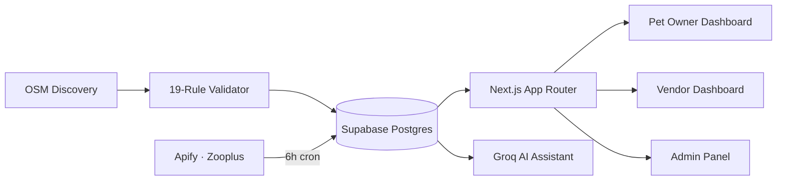

<div align="center">

# 🐾 PetSquare

**A personalized pet-deals marketplace for Europe — real vendors, real discounts, matched to your pet.**


_Phases 1–6 shipped · Phase 7 (i18n) next_

</div>

---

## ✨ What is this?

PetSquare finds real deals from real pet-care vendors — shops, groomers,
vets — across Europe, and ranks them for _your_ pet. It's a full-stack app
with its own web scraper, role-based admin system, a vendor self-service
dashboard, and a Groq-powered AI assistant. Not a prototype with mock
screens — real auth, a real database, and a real (if imperfect) discovery
pipeline behind it.

> 💡 **No backend? No problem.** The entire frontend runs standalone on mock
> data with zero setup — see [Running without Supabase](#-running-without-supabase).

---

## 🖼️ At a glance

|                                    |                                                                   |
| ---------------------------------- | ----------------------------------------------------------------- |
| 🏪 **Vendor directory & profiles** | Real, scraped, or vendor-submitted businesses                     |
| 🏷️ **Live deals feed**             | The signature die-cut "price tag" card, everywhere                |
| 🐕 **Pet Owner Dashboard**         | Pet profiles, personalized picks, saved items, price alerts       |
| 🤖 **AI Pet Assistant**            | Groq-powered chat, pet-aware, medically cautious                  |
| 🧑‍💼 **Vendor Dashboard**            | Onboarding, deal management, real analytics, inbox                |
| 🛡️ **Full Admin Panel**            | Moderation, RBAC, audit log, scraper monitor                      |
| 🎨 **Dual themes**                 | Nord & Forest (default) · Midnight OLED                           |
| 🌍 **10 languages planned**        | `en de fr it es pl ro cs hu pt` — routing built, translation next |

---

## 🚀 Quick start

```bash
npm install
npm run dev          # → http://localhost:3000
```

That's it for the UI. For the real backend:

<details>
<summary><strong>🔧 Full Supabase setup (free tier)</strong></summary>

1. Create a free project at [supabase.com](https://supabase.com)
2. In the **SQL Editor**, run in order:
   - `supabase/schema.sql`
   - `supabase/seed.sql`
3. Copy your keys from **Settings → API** into `.env.local`:

   ```dotenv
   NEXT_PUBLIC_SUPABASE_URL=https://your-project-ref.supabase.co
   NEXT_PUBLIC_SUPABASE_ANON_KEY=your-anon-public-key
   SUPABASE_SERVICE_ROLE_KEY=your-service-role-key
   SEED_SUPER_ADMIN_EMAIL=admin@petsquare.example
   SEED_SUPER_ADMIN_PASSWORD=ChangeMe123!
   ```

4. Seed your first admin login:

   ```bash
   npm run seed:admin
   ```

5. Sign in at `/auth/sign-in` with the printed credentials → visit `/admin`.
   **Change that password immediately.**

</details>

<details>
<summary><strong>🤖 AI Assistant setup (Groq — free)</strong></summary>

```dotenv
GROQ_API_KEY=your-groq-api-key
TAVILY_API_KEY=your-tavily-api-key
GROQ_MODEL=openai/gpt-oss-20b
```

Get a free key at [console.groq.com](https://console.groq.com). Without it,
`/dashboard/assistant` shows a clear "not configured" message instead of
failing silently.

</details>

<details>
<summary><strong>🕸️ Scraper & Zooplus cache setup</strong></summary>

- Vendor/product discovery uses OpenStreetMap by default — see
  [`docs/osm-scraper.md`](docs/osm-scraper.md).
- The Zooplus product cache runs via Apify on a 6-hour Vercel cron and
  writes into Supabase; live pages only ever read the cache, never trigger
  a paid run on visit. Run `supabase/apify-pet-data.sql` once, then set
  `APIFY_API_TOKEN` and `CRON_SECRET` per `.env.example`.

</details>

### 🧪 Running without Supabase

No `.env.local`? The app notices and gracefully degrades:

- Landing, vendor directory, deals, profiles → render mock data, fully styled
- Sign-in/sign-up → clear "not configured yet" notice, no crash
- `/admin` → redirects to `/admin/unauthorized`

---

## 🗺️ How it's built



| Layer           | Tech                                          |
| --------------- | --------------------------------------------- |
| Framework       | Next.js 16 (App Router), TypeScript           |
| Styling         | Tailwind CSS v4, Framer Motion, Lucide icons  |
| Database & Auth | Supabase (Postgres, Auth, Row Level Security) |
| AI              | Groq (chat), Tavily (search)                  |
| Scraping        | OSM discovery + a 19-rule validation pipeline |
| Hosting         | Vercel-ready, free tiers throughout           |

---

## 📦 Roadmap

- [x] **Phase 1** — Frontend: landing, vendor directory, deals, profiles
- [x] **Phase 2** — Supabase backend: schema, Auth, RLS, RBAC, seeded Super Admin
- [x] **Phase 3** — Web scraper: OSM discovery + 19-rule validation pipeline
- [x] **Phase 4** — Live data wiring + Pet Owner Dashboard + AI Assistant
- [x] **Phase 5** — Official logo, dual theme system, static navbar, Vendor Dashboard
- [x] **Phase 6** — Full-ish Admin Panel: moderation, RBAC, audit log, scraper monitor
- [ ] **Phase 7** — Multilingual content across 10 languages

<details>
<summary><strong>📖 Expand for what shipped in each phase</strong></summary>

**Phase 1 — Frontend foundation.** Landing page, vendor directory, vendor
profiles, and a deals directory, built against mock data.

**Phase 2 — Backend & RBAC.** Full Postgres schema with RLS, Supabase Auth
wired into sign-in/sign-up, six admin roles (Super Admin, Operations,
Content, Support, Moderator, Analyst), and a seeded Super Admin. `/admin` is
gated by an `admin_access` table — no public admin registration, ever.

**Phase 3 — The scraper.** OSM-based discovery feeding a full 19-rule
vendor/product validation pipeline, writing accepted results straight into
Supabase.

**Phase 4 — Going live + Pet Owner Dashboard.** Every Phase 1 page now reads
real Supabase data (mock as fallback, never a blank page). Pet profiles,
personalized recommendations by species, saved items, price-target alerts,
and a Groq-powered AI Pet Assistant with hard rules against giving medical
diagnoses.

**Phase 5 — Brand, themes, Vendor Dashboard.** The real logo everywhere,
two full themes (Nord & Forest / Midnight OLED) via semantic CSS variables,
a static navbar, and vendor self-service: onboarding, deal CRUD, real
click-through analytics, and a private inbox.

**Phase 6 — Admin Panel.** Full vendor management (edit/suspend/delete),
deal moderation across every vendor, reports & comment moderation, user
suspension, a read-only scraper monitor, and an audit log every admin
action now writes to automatically.

</details>

---

## 🎨 Design system

- **Palette** — navy `#16264A`, tangerine `#F2860B`, sunshine `#FFC53D`,
  sage `#6FA287`, coral `#FF6B54`, pulled straight from the logo.
- **Type** — Fredoka (display), Plus Jakarta Sans (body), IBM Plex Mono
  (prices & timestamps).
- **Signature element** — the die-cut "price tag" card (`.tag-card`),
  echoing the % tag in the logo. Used on every single deal card.
- **Theming** — every color is a semantic CSS variable; Midnight OLED is one
  override block, so zero components needed to change to support it.

---

## 📁 Project structure

<details>
<summary><strong>Click to expand full tree</strong></summary>

```
supabase/           schema.sql, seed.sql, apify-pet-data.sql
scraper/            OSM discovery, 19-rule validator, extractors, Supabase writer
scripts/            seed-super-admin.mjs
src/
  middleware.ts      session refresh + route guards
  lib/
    supabase/        client.ts, server.ts, middleware.ts
    data/            vendors.ts, deals.ts  (Supabase-first, mock-fallback)
    hooks/           use-save-item.ts, use-track-event.ts
    audit.ts          logAudit() — called from every admin action
  app/
    page.tsx, vendors/, deals/            public pages
    auth/                                  sign-in / sign-up
    api/assistant/, api/pet-data/          Groq + Apify cache endpoints
    admin/            vendors, deals, scraper, reports, comments, users,
                       access, audit-logs
    dashboard/        pets, saved, alerts, assistant, business
  components/         landing/, vendors/, dashboard/, admin/, theme/, ui/, auth/
public/brand/         logo SVGs + source PNGs
```

</details>

---

## ⚠️ Honest limitations

Nothing here is oversold — some things are genuinely incomplete:

- **No email notifications anywhere** yet (vendor approval, new messages,
  price-alert triggers) — no email service is wired up.
- **Price alerts don't fire on their own** — the dashboard shows if a
  target's been hit, but nothing pushes a notification without a scheduled job.
- **AI Assistant can't query the live deal catalog** — it's pet-aware chat,
  not yet a function-calling agent over Supabase.
- **The scraper can't be triggered from the admin UI** — `/admin/scraper` is
  read-only by design; it needs a background job runner to go further.
- **Species inference is keyword-based**, not a real product taxonomy — good
  enough for personalization, not perfect.
- **Nothing here has been tested against a live Supabase project** from the
  build sandbox — the schema, RLS policies, and query shapes all line up,
  but you'll be the first to click these buttons for real.

Full per-phase caveats live in the phase sections above — nothing's hidden,
just organized so the top of this file stays readable.

---

## 🤝 What's next

Phase 7 (10-language i18n) is the last item on the original roadmap.
Beyond that: CMS/newsletters, country-language admin screens, a real
notification system, and wiring the AI Assistant into live deal search.

<div align="center">

Made with 🐾 for European pet owners.

</div>
